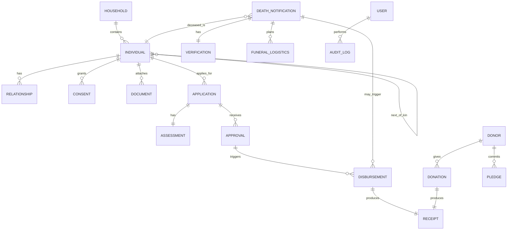

# Data Model & ERD

Status: Draft 0.2  
Owner: [Your Name]  
Last updated: 2025-11-11

This is a high-level ERD to validate entities and relationships. Final fields and constraints to be refined during implementation.

**Note**: Models/entities will be organized in the feature-based structure (see ./Feature-Based-Structure.md). Each feature module will have its own models in `/features/{feature-name}/shared/lib/`.

Field notes (examples; not exhaustive):
- Household: id, address_line, locality, postcode, gps(optional).  
- Individual: id, household_id, name, nric/passport, phone, dob, gender, status.  
- Relationship: individual_id, related_individual_id, type (spouse/child/NOK).  
- Consent: individual_id, scope, granted_at, method, notes.  
- Document: owner_type (individual/household/application), owner_id, type, url/blob, issued_at.  
- Application: id, applicant_individual_id, category(asnaf), submitted_at, status.  
- Assessment: application_id, assessor_id, findings, score, recommended_amount.  
- Approval: application_id, approver_id, decision, reason, decided_at.  
- Disbursement: id, application_id|death_notification_id, method(cash/bank), amount, reference, paid_at.  
- Receipt: disbursement_id|donation_id, number, issued_at, issued_by.  
- Donor: id, name, contact, preferences.  
- Donation: donor_id, amount, channel, received_at.  
- Pledge: donor_id, amount, frequency, start/end.  
- DeathNotification: id, deceased_individual_id, notifier, time_place, notes.  
- Verification: death_notification_id, verified_by, details, verified_at.  
- FuneralLogistics: death_notification_id, task, assigned_to, due_at, status.  
- User: id, role, name, email/phone, password_hash.  
- AuditLog: id, user_id, action, entity, entity_id, before, after, ip, created_at.

## File Organization

Models will be organized by feature:
- `/features/residents/shared/lib/` - Household.php, Individual.php, Relationship.php, Consent.php, Document.php
- `/features/assistance/shared/lib/` - Application.php, Assessment.php, Approval.php, Disbursement.php, Receipt.php
- `/features/donations/shared/lib/` - Donor.php, Donation.php, Pledge.php
- `/features/death-funeral/shared/lib/` - DeathNotification.php, Verification.php, FuneralLogistics.php
- `/features/events/shared/lib/` - Event.php
- `/features/users/shared/lib/` - UserModel.php
- `/features/shared/lib/audit/` - AuditLog.php

Each model class will use PDO for database operations (no ORM).

Open questions:
- Approval levels/thresholds?  
- Disbursement linkage to bank references?  
- Document storage: file system vs object storage.