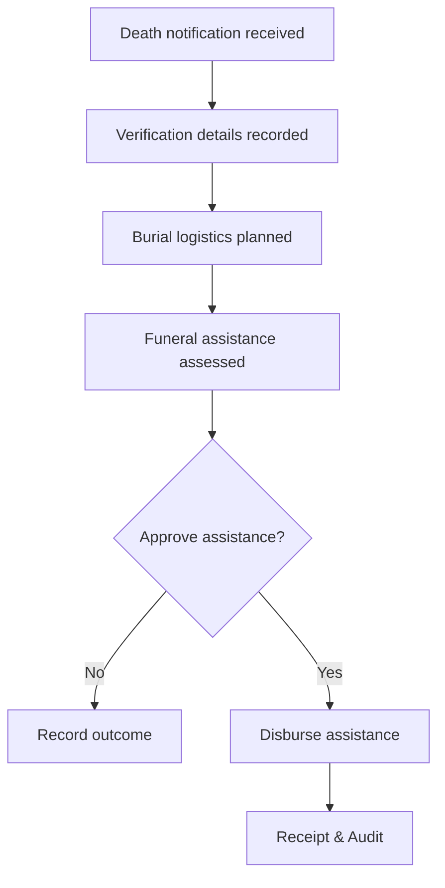

# Use Cases & Flows

Status: Draft 0.2  
Owner: [Your Name]  
Last updated: 2025-11-11

**Architecture Note**: All use cases map to feature modules in `/features/`. See ./Feature-Based-Structure.md for detailed file organization.

## Primary Use Cases
- Register household and individuals; manage relationships and documents.  
- Submit and process assistance (zakat) applications.  
- Record deaths and manage funeral logistics and assistance.  
- Record donations/pledges and issue receipts.  
- Publish events and announcements.  
- Search/filter and run summary reports.  
- Administer users and roles; review audit logs.

## Flow: Assistance (Application → Receipt)
```mermaid
flowchart TD
  A[Applicant creates application] --> B[Eligibility/Assessment]
  B --> C{Approve?}
  C -- No --> R[Reject with reason]
  C -- Yes --> D[Approval recorded]
  D --> E[Disbursement (cash/bank)]
  E --> F[Issue Receipt]
  F --> G[Update Reports & Audit Log]
```

## Flow: Death & Funeral


## Flow: Resident Registration
```mermaid
flowchart TD
  S[Search existing residents/households] --> C{Found?}
  C -- Yes --> U[Update record; add docs/consent]
  C -- No  --> N[Create household & individuals]
  U --> L[Link relationships (family/NOK)]
  N --> L[Link relationships (family/NOK)]
  L --> A[Audit log entry]
```

## Notes
- Keep flows simple for MVP (single-step approval).  
- Add alternative paths and error states after MVP baseline is validated.  
- Align screens to steps in each flow for a coherent UX.